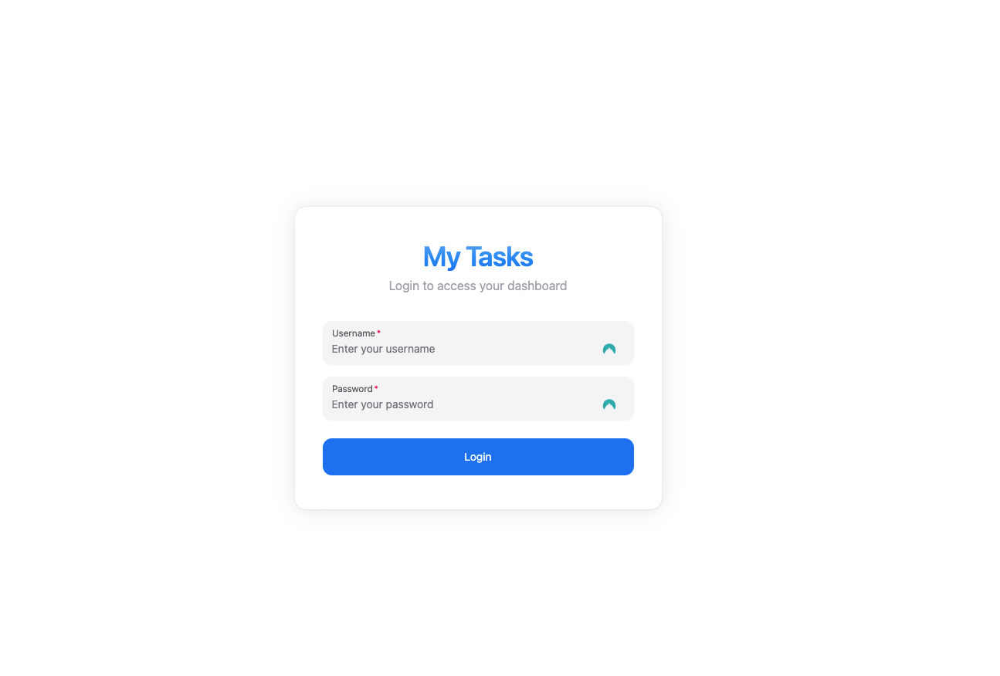
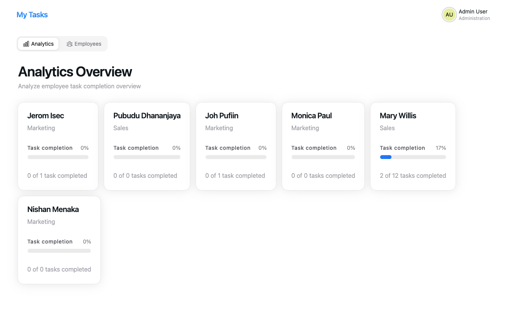
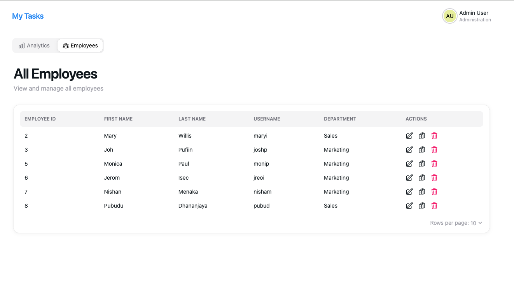
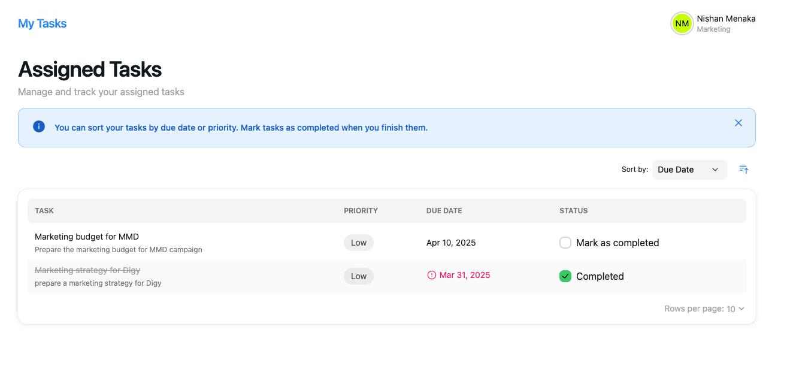

# 📝 My Tasks

A mini system that allows employees to track their to-do items and admins to monitor progress via an analytics
dashboard. Built with **ReactJS + Vite**, **NestJS**, and **Cockroach DB**.

---

### Table of Contents

- [🌐 Live URLs](#-live-urls)
- [👤 Demo Users](#-demo-users)
- [📁 Project Structure](#-project-structure)
- [🚀 Tech Stack](#-tech-stack)
- [✨ Features](#-features)
    - [🔐 Authentication](#-authentication)
    - [👨‍💼 Admin Dashboard](#-admin-dashboard)
    - [👩‍💻 Employee Dashboard](#-employee-dashboard)
- [✅ Development Checklist](#-development-checklist)
    - [Core Features](#core-features)
    - [Bonus Features](#bonus-features)
- [🛠️ Setup Instructions](#-setup-instructions)
- [🔔 Push Notifications](#-push-notifications)
- [📸 Project Screenshots](#-project-screenshots)

---

## 🌐 Live URLs

- WEB: https://my-tasks.khprojects.xyz
- REST API: https://my-tasks-api.khprojects.xyz
    - [Postman collection](https://drive.google.com/file/d/13g-q6VFkLnWLbqvG5ch8RNqMX-s-dc2_/view?usp=sharing)

## 👤 Demo Users

```
Admin:
username: admin
password: password

Mary:
username: maryi
password: password

Nishan:
username: nisham
password: password
```

## 📁 Project Structure

```
monorepo/ 
├── api/ # NestJS backend
├── client/ # React + Vite frontend 
```

## 🚀 Tech Stack

- **Frontend:** ReactJS (Vite) + TypeScript + HeroUI
- **Backend:** NestJS + TypeScript
- **Database:** Cockroach DB + TypeORM
- **Notifications:** Firebase Cloud Messaging
- **Hosting**:  AWS (Amazon Web Services)

---

## ✨ Features

### 🔐 Authentication

- Login screen with username & password

### 👨‍💼 Admin Dashboard

- **Analytics Tab**
    - Overview of task completion per employee
- **Employees Tab**
    - Table with employee data:
        - ID, Name, Username, Department
        - Actions: Update / Delete / Task Assign
- **Task Assignment**
    - Create and assign to employees in the employees table

### 👩‍💻 Employee Dashboard

- Sortable task list (by due date, priority)
- Mark tasks as complete
- Completed tasks appear in a different color and move to bottom
- Tasks can be unchecked if needed

---

## ✅ Development Checklist

### Core Features

- [x] Authentication
- [x] Employee list view with CRUD
- [x] Task creation and assignment
- [x] Employee task list (sortable)
- [x] Mark/unmark tasks as completed
- [x] Analytics dashboard (tasks per employee)

### Bonus Features

- [x] Push notifications for task assignment
- [ ] Push notifications for task completion
- [ ] Unit tests
- [ ] Dockerized setup
- [x] Mobile responsive UI (partial)
- [x] Hosted on AWS / Cloud platform
- [ ] Enhanced analytics dashboard

---

## 🛠️ Setup Instructions

1. **Setup Database**
    - Create a Cockroach DB database via [Cockroachlabs](https://cockroachlabs.cloud/)
   ```sql
     CREATE DATABASE my_tasks;
     ```
    - Create `employee_seq` sequence in the DB
   ```sql
    CREATE SEQUENCE IF NOT EXISTS employee_seq;
    ```
    - Migration
   ```bash
   pnpm run migration:generate
   pnpm run migration:run
   ```

2. **Clone the Repository**
   ```bash
   git clone git@github.com:kaveenhyacinth/my-tasks.git
   cd my-tasks
   ```

3. **Backend Setup**
    ```bash
   cd api
   cp .env.example .env
   # Please contact for env variables
   pnpm install
   pnpm run start:dev
   ```
4. **Frontend Setup**
    ```bash
   cd client
    cp .env.example .env
    # Please contact for env variables
    pnpm install
    pnpm run dev
    ```

---

## 🔔 Push Notifications

### Request Notification Permission

To enable push notifications, the application will request permission from the user. This is typically done when the
user first visits the site or when they perform an action that requires notifications.

### Enable Notifications in the Browser

Ensure that notifications are enabled in the browser settings. Users may need to manually allow notifications if they
have previously blocked them.

---

## 📸 Project Screenshots






---

> MIT © Kaveen Hyacinth